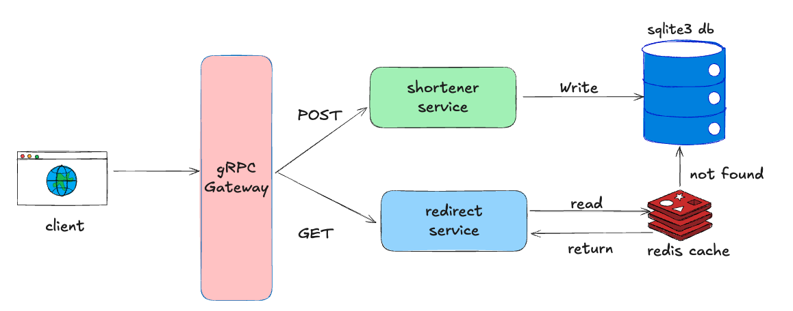

# 🔗 URL Shortener

A fully functional and extensible URL shortener built in Go with support for:

- REST and gRPC APIs (with grpc-gateway)
- Custom aliases
- Expiry support
- Redis caching for fast redirects
- SQLite database for persistence
- Unit-tested with isolated environments

---

## 🚀 Features

- ✂️ Shorten any long URL with optional **custom alias**
- ⏳ Set **expiry time** in days for each URL
- 🧠 **Cache-first lookup** using Redis for fast redirection
- 🔄 Dual API support:
  - REST (via grpc-gateway)
  - gRPC (native)
- ✅ Fully unit-tested (DB + gRPC)
- ⚡ Load-tested using [`hey`](https://github.com/rakyll/hey)

---
## 🏗️ Architecture

--

## 📦 Tech Stack

- Language: **Go**
- Database: **SQLite3**
- Cache: **Redis**
- gRPC + REST via **grpc-gateway**
- Testing: `go test`, isolated test DB

---

## 🔧 Getting Started

### 1. Clone the Repo

```bash
git clone https://github.com/santoshkowshikhr/url-shortener.git
cd url-shortener
```

### 2. Start Redis (optional for caching)
```bash
docker run -p 6379:6379 redis
```

### 3. Run the gRPC and REST Servers
```bash
# gRPC server
go run cmd/gRPC/main.go

# REST gateway (on :8080)
go run cmd/REST/main.go
```

## 🔌 API Usage
### 🔹 Shorten a URL (REST)
```bash
curl -X POST http://localhost:8080/shorten \
  -H "Content-Type: application/json" \
  -d '{
    "long_url": "https://example.com",
    "custom_alias": "myalias",
    "expire_in_days": 5
}'
```

### 📁 Project Structure
```bash
go-url-shortener/
├── api/               # gRPC & gateway proto definitions
├── cmd/               # Main gRPC and REST entrypoints
├── docs/              # Architecture diagrams
├── grpc/              # gRPC server logic
├── model/             # SQLite DB access layer
```

### 🧪 Run Units Tests
```bash
go test ./...
```

### 📊 Stress Results Summary:
```bash
hey -n 100000 -c 5000 -m POST \
  -H "Content-Type: application/json" \
  -d '{"long_url": "https://example.com", "custom_alias": "stress1", "expire_in_days": 2}' \
  http://localhost:8080/shorten


Summary:
  Total:	12.2770 secs
  Slowest:	4.4408 secs
  Fastest:	0.0002 secs
  Average:	0.5716 secs
  Requests/sec:	8145.3396

  Total data:	5600000 bytes
  Size/request:	56 bytes

Response time histogram:
  0.000 [1]	|
  0.444 [47254]	|■■■■■■■■■■■■■■■■■■■■■■■■■■■■■■■■■■■■■■■■
  0.888 [30291]	|■■■■■■■■■■■■■■■■■■■■■■■■■■
  1.332 [16780]	|■■■■■■■■■■■■■■
  1.776 [4120]	|■■■
  2.220 [1288]	|■
  2.665 [226]	|
  3.109 [21]	|
  3.553 [10]	|
  3.997 [0]	|
  4.441 [9]	|


Latency distribution:
  10% in 0.0244 secs
  25% in 0.2005 secs
  50% in 0.5243 secs
  75% in 0.8544 secs
  90% in 1.1708 secs
  95% in 1.3831 secs
  99% in 1.8354 secs

Details (average, fastest, slowest):
  DNS+dialup:	0.0107 secs, 0.0002 secs, 4.4408 secs
  DNS-lookup:	0.0012 secs, 0.0000 secs, 0.0950 secs
  req write:	0.0000 secs, 0.0000 secs, 0.0763 secs
  resp wait:	0.5102 secs, 0.0002 secs, 4.1116 secs
  resp read:	0.0001 secs, 0.0000 secs, 0.0537 secs

Status code distribution:
  [409]	100000 responses
```

or run with k6
```bash
k6 run --vus 1000 --iterations 100000 script.js

         /\      Grafana   /‾‾/
    /\  /  \     |\  __   /  /
   /  \/    \    | |/ /  /   ‾‾\
  /          \   |   (  |  (‾)  |
 / __________ \  |_|\_\  \_____/

     execution: local
        script: script.js
        output: -

     scenarios: (100.00%) 1 scenario, 1000 max VUs, 10m30s max duration (incl. graceful stop):
              * default: 100000 iterations shared among 1000 VUs (maxDuration: 10m0s, gracefulStop: 30s)


  █ TOTAL RESULTS

    HTTP
    http_req_duration.......................................................: avg=2.72s min=196µs    med=3.02s max=10.35s p(90)=5.17s p(95)=5.2s
      { expected_response:true }............................................: avg=3.2s  min=454µs    med=5.13s max=10.35s p(90)=5.18s p(95)=5.21s
    http_req_failed.........................................................: 20.56% 20561 out of 100000
    http_reqs...............................................................: 100000 362.623192/s

    EXECUTION
    iteration_duration......................................................: avg=2.72s min=216.16µs med=3.03s max=10.54s p(90)=5.17s p(95)=5.2s
    iterations..............................................................: 100000 362.623192/s
    vus.....................................................................: 108    min=108             max=1000
    vus_max.................................................................: 1000   min=1000            max=1000

    NETWORK
    data_received...........................................................: 20 MB  71 kB/s
    data_sent...............................................................: 21 MB  77 kB/s


running (04m35.8s), 0000/1000 VUs, 100000 complete and 0 interrupted iterations
default ✓ [======================================] 1000 VUs  04m35.8s/10m0s  100000/100000 shared iters
```

🧠 Future Improvements

- Auth + rate limiting

- Analytics (click counts, referrer tracking)

- PostgreSQL backend

- Admin dashboard for link management


### 🙌 Credits

Created with ❤️ by Santosh Kowshik
